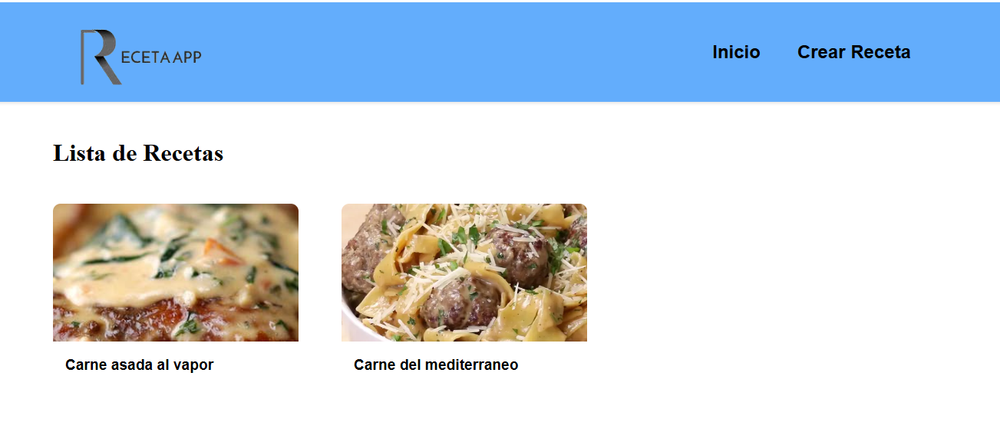

# Prueba_tecnica_spring_angular

Repositorio de la prueba: 
https://github.com/NessDisk/Prueba_tecnica_spring_angular

El proyecto es un sistema de gestión de recetas, donde se pueden crear, editar, eliminar y buscar recetas.

El proyecto se ha creado con Spring Boot  en el backend y Angular para el frontend.

------  ------  ------  ------  ------  ------  
para ejecutar el el servidor Spring Boot se debe ejecutar el siguiente comando:

cd backend

mvn spring-boot:run

El proyecto tiene swagger para la documentación de la API.

http://localhost:8081/swagger-ui/index.html#/

------  ------  ------  ------  ------  ------     

Para ejecutar el frontend se debe ejecutar el siguiente comando:

         cd recetas-app
  
         npm install

para arrancar el servidor:

        ng serve

     http://localhost:4200/

------  ------  ------  ------  ------  ------  

Para agregar imagenes 5 url que se pueden usar para agregarlas como prueba

https://img.buzzfeed.com/thumbnailer-prod-us-east-1/1c4c0c0dece7467c9c4175cb759ed6a7/BFV14220_3CourseTuscanChickenDinner-FB.jpg?resize=300:*&output-format=jpg&output-quality=auto

https://img.buzzfeed.com/thumbnailer-prod-us-east-1/f69a7f4192b94d8395757b365ac6d866/GarlicParmPasta.jpg?resize=600:*&output-format=auto&output-quality=auto

https://img.buzzfeed.com/video-api-prod/assets/e1119589710f4cc19266fc5f05448933/BFV10386_Cheesy_Chicken_Alfredo_Pasta_Bake_Recipe_Photo_2.jpg?resize=600:*&output-format=auto&output-quality=auto

https://img.buzzfeed.com/video-api-prod/assets/ba8b9b30531c4058956bbe5c1296bbc8/Thumb_A_FB.jpg?resize=600:*&output-format=auto&output-quality=auto

https://img.buzzfeed.com/thumbnailer-prod-us-east-1/37b0c33cf11a481f8189f6c37422b704/BFV8525_One-Pot_Swedish_Meatball_Pasta-FB1080.jpg?resize=600:*&output-format=auto&output-quality=auto

